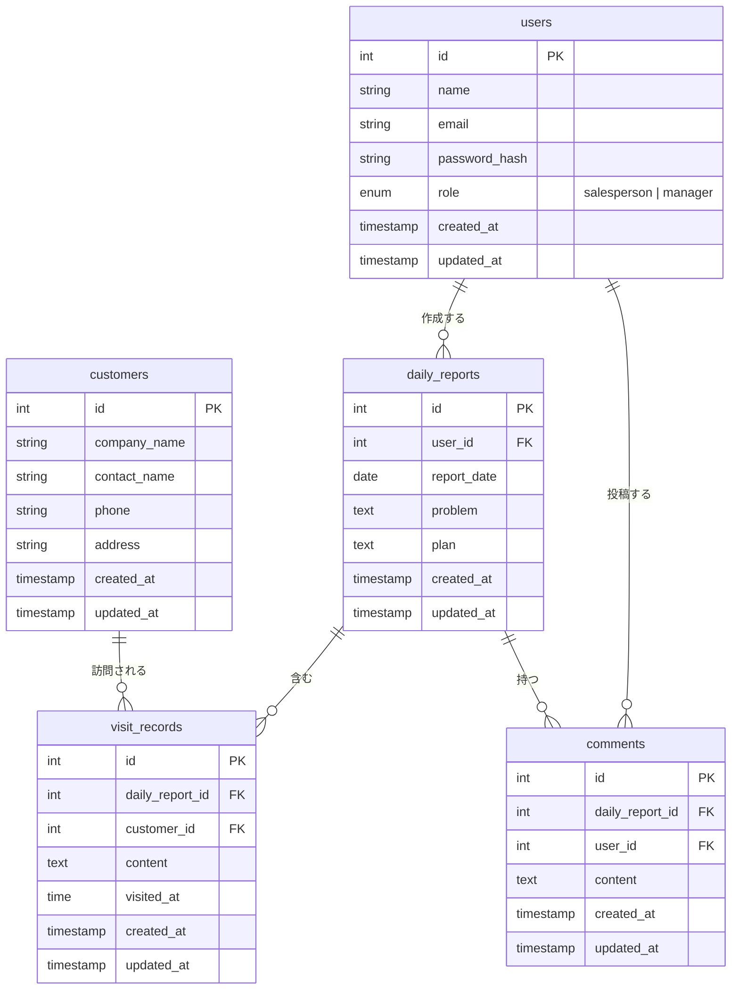

```mermaid
erDiagram
    users {
        int id PK
        string name
        string email
        string password_hash
        enum role "salesperson | manager"
        timestamp created_at
        timestamp updated_at
    }

    customers {
        int id PK
        string company_name
        string contact_name
        string phone
        string address
        timestamp created_at
        timestamp updated_at
    }

    daily_reports {
        int id PK
        int user_id FK
        date report_date
        text problem
        text plan
        timestamp created_at
        timestamp updated_at
    }

    visit_records {
        int id PK
        int daily_report_id FK
        int customer_id FK
        text content
        time visited_at
        timestamp created_at
        timestamp updated_at
    }

    comments {
        int id PK
        int daily_report_id FK
        int user_id FK
        text content
        timestamp created_at
        timestamp updated_at
    }

    users ||--o{ daily_reports : "作成する"
    users ||--o{ comments : "投稿する"
    daily_reports ||--o{ visit_records : "含む"
    daily_reports ||--o{ comments : "持つ"
    customers ||--o{ visit_records : "訪問される"
```
