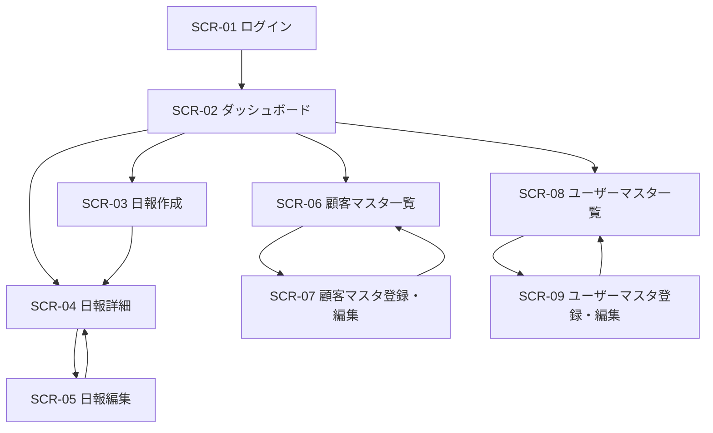

# 画面定義書 — 営業日報システム

## 画面一覧

| 画面ID | 画面名 | 対象ユーザー |
|--------|--------|-------------|
| SCR-01 | ログイン画面 | 全員 |
| SCR-02 | ダッシュボード（日報一覧） | 全員 |
| SCR-03 | 日報作成画面 | 営業担当者 |
| SCR-04 | 日報詳細画面 | 全員 |
| SCR-05 | 日報編集画面 | 営業担当者 |
| SCR-06 | 顧客マスタ一覧画面 | 全員 |
| SCR-07 | 顧客マスタ登録・編集画面 | 上長 |
| SCR-08 | ユーザーマスタ一覧画面 | 上長 |
| SCR-09 | ユーザーマスタ登録・編集画面 | 上長 |

---

## SCR-01 ログイン画面

### 概要
システムへのログインを行う画面。

### 入力項目

| 項目名 | 種別 | 必須 | 備考 |
|--------|------|------|------|
| メールアドレス | テキスト | ○ | |
| パスワード | パスワード | ○ | |

### ボタン

| ボタン名 | アクション |
|----------|-----------|
| ログイン | 認証を行い、ダッシュボードへ遷移 |

### バリデーション
- メールアドレス・パスワードが未入力の場合はエラーメッセージを表示
- 認証失敗時は「メールアドレスまたはパスワードが正しくありません」を表示

### 遷移先
- ログイン成功 → SCR-02 ダッシュボード

---

## SCR-02 ダッシュボード（日報一覧）

### 概要
日報の一覧を表示する。営業担当者は自分の日報のみ、上長は全営業担当者の日報を閲覧できる。

### 表示項目

| 項目名 | 備考 |
|--------|------|
| 日付 | 報告日 |
| 担当者名 | 上長のみ表示 |
| 訪問件数 | visit_records の件数 |
| 登録日時 | |

### フィルター・検索

| 項目名 | 種別 | 備考 |
|--------|------|------|
| 期間 | 日付範囲 | 開始日・終了日 |
| 担当者 | セレクトボックス | 上長のみ表示 |

### ボタン

| ボタン名 | 表示条件 | アクション |
|----------|---------|-----------|
| 日報を作成 | 営業担当者のみ | SCR-03 へ遷移 |
| 詳細 | 各行 | SCR-04 へ遷移 |

---

## SCR-03 日報作成画面

### 概要
営業担当者が日報を新規作成する画面。

### 入力項目

#### 基本情報

| 項目名 | 種別 | 必須 | 備考 |
|--------|------|------|------|
| 報告日 | 日付 | ○ | デフォルト：当日 |

#### 訪問記録（複数件追加可能）

| 項目名 | 種別 | 必須 | 備考 |
|--------|------|------|------|
| 訪問時刻 | 時刻 | ○ | HH:MM形式 |
| 顧客 | セレクトボックス | ○ | 顧客マスタから選択 |
| 訪問内容 | テキストエリア | ○ | |

#### Problem / Plan

| 項目名 | 種別 | 必須 | 備考 |
|--------|------|------|------|
| Problem（課題・相談） | テキストエリア | - | |
| Plan（明日やること） | テキストエリア | - | |

### ボタン

| ボタン名 | アクション |
|----------|-----------|
| 訪問記録を追加 | 訪問記録の入力欄を1件追加 |
| 削除 | 対象の訪問記録入力欄を削除 |
| 保存 | 日報を登録し SCR-04 へ遷移 |
| キャンセル | SCR-02 へ戻る |

### バリデーション
- 報告日が未入力の場合はエラー
- 訪問記録が1件もない場合はエラー
- 訪問記録の必須項目（訪問時刻・顧客・訪問内容）が未入力の場合はエラー
- 同一報告日の日報が既に存在する場合はエラー

### 遷移先
- 保存成功 → SCR-04 日報詳細画面

---

## SCR-04 日報詳細画面

### 概要
日報の詳細を表示し、上長がコメントを投稿できる画面。

### 表示項目

#### 基本情報

| 項目名 | 備考 |
|--------|------|
| 報告日 | |
| 担当者名 | |
| 登録日時 | |

#### 訪問記録一覧

| 項目名 | 備考 |
|--------|------|
| 訪問時刻 | |
| 顧客名 | |
| 訪問内容 | |

#### Problem / Plan

| 項目名 | 備考 |
|--------|------|
| Problem（課題・相談） | |
| Plan（明日やること） | |

#### コメント一覧

| 項目名 | 備考 |
|--------|------|
| コメント投稿者名 | |
| コメント内容 | |
| 投稿日時 | |

#### コメント入力欄

| 項目名 | 種別 | 必須 | 表示条件 | 備考 |
|--------|------|------|---------|------|
| コメント | テキストエリア | ○ | 上長のみ | |

### ボタン

| ボタン名 | 表示条件 | アクション |
|----------|---------|-----------|
| 編集 | 営業担当者・自分の日報のみ | SCR-05 へ遷移 |
| コメントを投稿 | 上長のみ | コメントを保存し画面を更新 |
| 一覧へ戻る | 全員 | SCR-02 へ遷移 |

### バリデーション
- コメントが未入力の場合は投稿ボタンを非活性

---

## SCR-05 日報編集画面

### 概要
作成済みの日報を編集する画面。SCR-03 と同レイアウト。

### SCR-03 との差分
- 既存データが初期値として表示される
- ボタン名が「更新」になる

### バリデーション
- SCR-03 と同様

### 遷移先
- 更新成功 → SCR-04 日報詳細画面

---

## SCR-06 顧客マスタ一覧画面

### 概要
登録済み顧客の一覧を表示する。

### 表示項目

| 項目名 | 備考 |
|--------|------|
| 会社名 | |
| 担当者名 | |
| 電話番号 | |
| 住所 | |
| 登録日時 | |

### フィルター・検索

| 項目名 | 種別 | 備考 |
|--------|------|------|
| キーワード | テキスト | 会社名・担当者名で絞り込み |

### ボタン

| ボタン名 | 表示条件 | アクション |
|----------|---------|-----------|
| 新規登録 | 上長のみ | SCR-07（新規）へ遷移 |
| 編集 | 上長のみ・各行 | SCR-07（編集）へ遷移 |
| 削除 | 上長のみ・各行 | 確認ダイアログ表示後に削除 |

---

## SCR-07 顧客マスタ登録・編集画面

### 概要
顧客情報を登録・編集する画面。上長のみ操作可能。

### 入力項目

| 項目名 | 種別 | 必須 | 備考 |
|--------|------|------|------|
| 会社名 | テキスト | ○ | |
| 担当者名 | テキスト | ○ | |
| 電話番号 | テキスト | - | |
| 住所 | テキスト | - | |

### ボタン

| ボタン名 | アクション |
|----------|-----------|
| 保存 | 登録・更新し SCR-06 へ遷移 |
| キャンセル | SCR-06 へ戻る |

### バリデーション
- 会社名・担当者名が未入力の場合はエラー

---

## SCR-08 ユーザーマスタ一覧画面

### 概要
登録済みユーザーの一覧を表示する。上長のみアクセス可能。

### 表示項目

| 項目名 | 備考 |
|--------|------|
| 氏名 | |
| メールアドレス | |
| ロール | 営業担当者 / 上長 |
| 登録日時 | |

### ボタン

| ボタン名 | アクション |
|----------|-----------|
| 新規登録 | SCR-09（新規）へ遷移 |
| 編集 | SCR-09（編集）へ遷移 |
| 削除 | 確認ダイアログ表示後に削除 |

---

## SCR-09 ユーザーマスタ登録・編集画面

### 概要
ユーザー情報を登録・編集する画面。上長のみ操作可能。

### 入力項目

| 項目名 | 種別 | 必須 | 備考 |
|--------|------|------|------|
| 氏名 | テキスト | ○ | |
| メールアドレス | テキスト | ○ | |
| パスワード | パスワード | ○ | 新規登録時のみ必須 |
| ロール | セレクトボックス | ○ | 営業担当者 / 上長 |

### ボタン

| ボタン名 | アクション |
|----------|-----------|
| 保存 | 登録・更新し SCR-08 へ遷移 |
| キャンセル | SCR-08 へ戻る |

### バリデーション
- 氏名・メールアドレス・ロールが未入力の場合はエラー
- メールアドレスが既に登録済みの場合はエラー
- パスワードは8文字以上

---

## 画面遷移図

